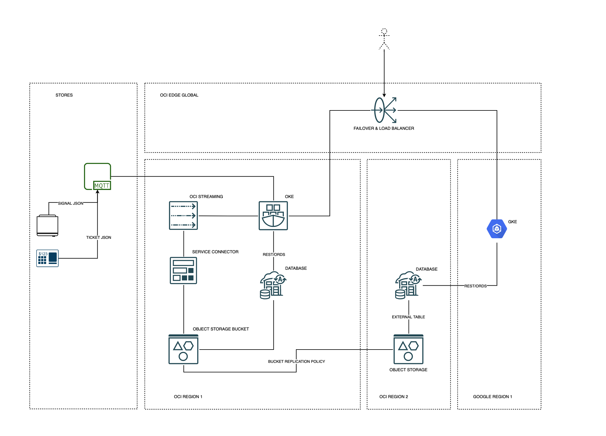
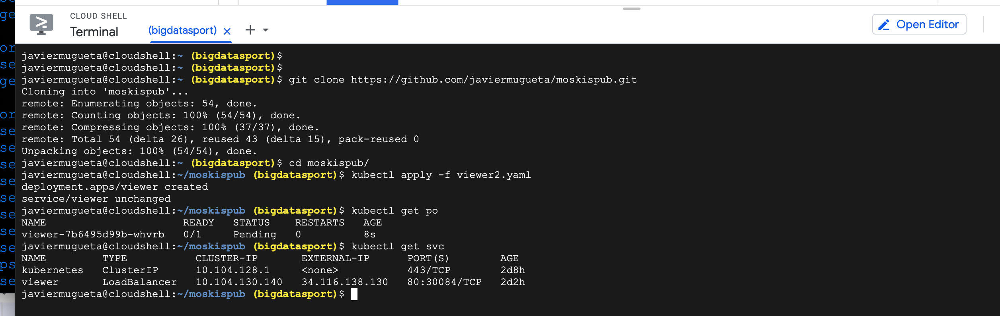

# signals (moskis)


## 

[Take a look at this blog](https://javiermugueta.blog/2021/05/27/creating-a-high-available-multi-region-datalake-with-2-oracle-autonomous-databases-and-2-replicated-object-storage-buckets-for-purposes-such-as-reporting-ml-or-ai-part-one/)

## mqtt producer
```
./mqttgen.sh
```

## oci streaming microbatch producer
```
docker build -t javiermugueta/osp -f Dockerfile.osp .
docker push javiermugueta/osp
kubectl create configmap myppk --from-file=myppk=./myppk 
kubectl get configmaps myppk -o yaml
kubectl apply -f osp.yaml
```

## mqtt to oci streaming microbatch transceiver
```
docker build -t javiermugueta/m2os -f Dockerfile.m2os .
docker push javiermugueta/m2os
kubectl create configmap myppk --from-file=myppk=./myppk 
kubectl get configmaps myppk -o yaml
kubectl apply -f m2os.yaml
```

## reader microservice in oci
```
docker build  -t javiermugueta/viewer  -f Dockerfile.viewer .
docker push javiermugueta/viewer 
kubectl apply -f viewer1.yaml
```
## gke cluster creation
```
gcloud beta container --project "<yourproject>" clusters create-auto "autopilot-cluster-1" --region "<region>" --release-channel "regular" --network "projects/<project>/global/networks/default" --subnetwork "projects/<project>/regions/<region>/subnetworks/default" --cluster-ipv4-cidr "/17" --services-ipv4-cidr "/22"
```

## deploy reader microservice in gke
```
git clone https://github.com/javiermugueta/moskispub.git
kubectl apply -f viewer2.yaml
```


## external table in db1 and db2
```
-- allows database connection to object storage via a dynamic group an policy created in step1
EXEC DBMS_CLOUD_ADMIN.ENABLE_RESOURCE_PRINCIPAL();
/
-- create external table
BEGIN
   DBMS_CLOUD.CREATE_EXTERNAL_TABLE(
    table_name =>'signals1',
    credential_name =>'OCI$RESOURCE_PRINCIPAL',
    file_uri_list =>'https://objectstorage.<region>.oraclecloud.com/n/<namespace>/b/signals1/o/*.data.gz',
    format => json_object('delimiter' value '~', 'compression' value 'gzip'),
    column_list => 'jsondata VARCHAR2 (23767)' );
END;
/
-- create view
create view signals1v as (select j.jsondata.timestamp, 
JSON_VALUE(utl_raw.cast_to_varchar2(utl_encode.base64_decode(utl_raw.cast_to_raw(j.jsondata.value))), '$.t') t,
JSON_VALUE(utl_raw.cast_to_varchar2(utl_encode.base64_decode(utl_raw.cast_to_raw(j.jsondata.value))), '$.d') d,
JSON_VALUE(utl_raw.cast_to_varchar2(utl_encode.base64_decode(utl_raw.cast_to_raw(j.jsondata.value))), '$.v') v from signals1 j)
/
```
